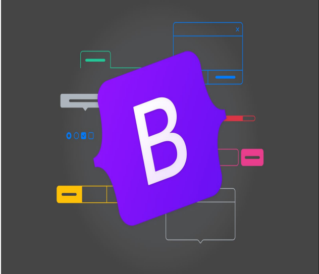

# bootstrap_base
<p align="center">
  
</p>

## 💻 Sobre o bootstrap_base

O **bootstrap_base** aula com finalidade de ensinar conceitos básicos do framework **Bootstrap**, com exercícios e desafios, para que o aluno entenda de forma clara tudo que for passado.

Este projeto foi desenvolvido como parte do currículo do curso **Técnico em Desenvolvimento de Sistemas** da Escola **SENAI A. Jacob Lafer**.

---

## ⚙️ Funcionalidades e Conceitos Aplicado

Durante o desenvolvimento dos exercícios, foram aplicados os seguintes conceitos:

**Manipulação do DOM:** Seleção e alteração dinâmica de elementos HTML.

**Alteração de Estilos via JavaScript:** Modificação de classes e estilos inline.

**Armazenamento Local:** Uso de localStorage para persistência de dados.

**Requisições Assíncronas:** Consumo de APIs utilizando fetch().

**Async/Await:** Escrita de código assíncrono de forma mais limpa e organizada.

**Tratamento de Erros:** Uso de try...catch para lidar com falhas em requisições.

**Validação de Formulários:** Verificação de campos e controle de envio.


## 🛠 Tecnologias Utilizadas

As seguintes ferramentas foram usadas na construção do projeto:

-    **HTML5**
-    **CSS3**
-    **JavaScript**
-    **Git**

---

## 📂 Estrutura de Pastas

```bash
js-base/
├── ex0_guia-completo-bootstrap # Explicação sobre Bootstrap
├── ex0a_guia-icones-boostrap # Icones do Bootstrap
├── ex1_instalacao-cdn # Instalação via cdn
├── ex1a_instalacao_arquivos # Instalação via arquivos/dowload
├── ex1b_instalacao_npm # Instalção via npm
├── ex2_sistema-grid # Sistema de grid do Bootstrap para criar layouts responsivos.
├── ex3_botoes # Como criar e estilizar botões utilizando o Bootstrap
├── ex4_formulario-sub-css # Como criar um formulário utilizando o Bootstrap
├── ex5_cards # Como criar cards responsivos utilizando o framework Bootstrap
├── ex5a-al-fazer-grid(ex) # Exercício para a criação de um Layout com Grid e Cards
├── ex5b-al-fazer-formulario-(ex) # Exercício para um Formulário Moderno e Minimalista
├── ex6_navbar # Como criar duas barras de navegação responsivas utilizando Bootstrap
├── ex7_modal # Como criar um modal interativo utilizando Bootstrap
├── ex8_caroussel # Como criar um carousel (slideshow) responsivo utilizando Bootstrap
├── ex9_alerts_progress-sub-js # Como criar uma interface interativa utilizando Bootstrap
├── ex10_layout-completo # Criar um layout completo e responsivo utilizando Bootstrap
├── ex10a-al-fazer-nav-modal-(ex) # Exercício para um formulário de Contato com Modal
├── ex10b-al-fazer-grid-(ex) #  Exercício de uma Loja Online com Navbar, Carrossel e Notificações Dinâmicas 
├── ex11_projeto_art # Criação de uma Galeria de Arte Urbana com Bootstrap
├── ex12_projeto-perfectwatch # CDriação do projeto PerfectWatch
├── ex13_projeto_imovi # Criação do projeto Imovi
├── README.md # Apresentação do que foi feito no repositório
